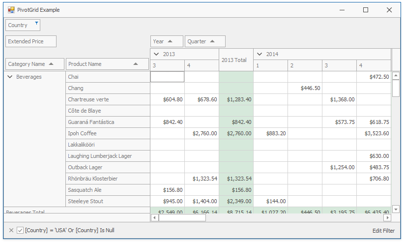

<!-- default badges list -->

<!-- default badges end -->
# How to Create the Fields and Bind the PivotGridControl to Data in Code

This example demonstrates how to create the [pivot grid fields](https://docs.devexpress.com/WindowsForms/1918) in code and specify their location and format. The PivotGridControl's data source is the [ExcelDataSource](https://docs.devexpress.com/CoreLibraries/DevExpress.DataAccess.Excel.ExcelDataSource) instance, created in code.

API in this example:

* [PivotGridField](https://docs.devexpress.com/WindowsForms/DevExpress.XtraPivotGrid.PivotGridField) class
* [PivotArea](https://docs.devexpress.com/CoreLibraries/DevExpress.XtraPivotGrid.PivotArea) enum
* [PivotGroupInterval](https://docs.devexpress.com/CoreLibraries/DevExpress.XtraPivotGrid.PivotGroupInterval) enum
* [FormatInfo](https://docs.devexpress.com/CoreLibraries/DevExpress.Utils.FormatInfo) class
* [PivotGridFieldFilterValues](https://docs.devexpress.com/CoreLibraries/DevExpress.XtraPivotGrid.PivotGridFieldFilterValues) class
* [PivotGridControl.BestFit](https://docs.devexpress.com/WindowsForms/DevExpress.XtraPivotGrid.PivotGridControl.BestFit) method

**See also:**

* [Pivot Grid Fields](https://docs.devexpress.com/WindowsForms/1918)
